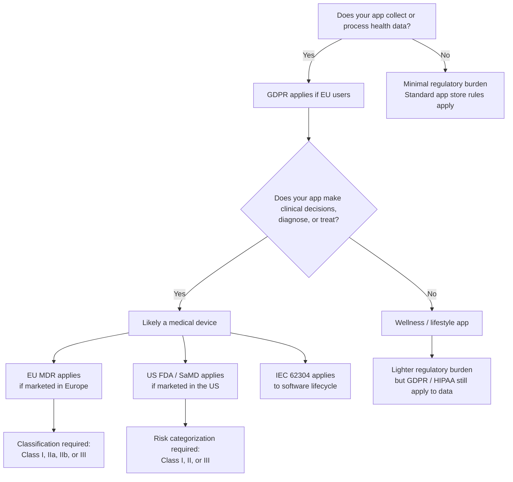

# mHealth Regulations Quick Reference

**Mobile Apps for Healthcare — AGH University of Krakow**

!!! info "Why this page exists"
    The project rubric requires *"relevant regulations identified and discussed"* for full marks on mHealth Awareness (15 points). GDPR and HIPAA are covered in Weeks 8-9. This page fills the gaps for **EU MDR**, **US FDA/SaMD**, **IEC 62304**, and **Germany's DiGA** — frameworks that are mentioned in lectures but not taught in depth.

---

## Decision Flowchart: "Is My App Regulated?"

Use this flowchart to determine which regulations apply to your project:

!!! tip "For your student project"
    Most student projects are **wellness/lifestyle apps** (path F→J). You won't need full MDR/FDA compliance, but you **must** demonstrate awareness of which regulations would apply if the app were commercialized.

---

## Framework-by-Framework Reference

### 1. GDPR — General Data Protection Regulation

> Covered in detail in **Week 8 lecture**. This is a brief recap.

| | |
|---|---|
| **What it is** | EU regulation governing the processing of personal data of EU residents |
| **Who it applies to** | Any app that processes personal data of people in the EU — regardless of where the company is based |
| **Key requirements** | Lawful basis for processing, data minimization, purpose limitation, storage limitation, right to erasure, breach notification within 72 hours |
| **For your project** | Document what health data you collect, why, and how you protect it. Implement consent mechanisms and a way to delete user data. |

The 7 GDPR principles are covered in the Week 8 lecture notes — refer there for the detailed implementation checklist.

### 2. HIPAA — Health Insurance Portability and Accountability Act

> Covered in detail in **Week 9 lecture**. This is a brief recap.

| | |
|---|---|
| **What it is** | US federal law protecting sensitive patient health information |
| **Who it applies to** | Covered entities (healthcare providers, insurers) and their business associates — primarily a US concern |
| **Key concept** | **Protected Health Information (PHI)** — any individually identifiable health information (name + diagnosis, name + treatment, etc.) |
| **Three rules** | (1) **Privacy Rule** — who can access PHI, (2) **Security Rule** — technical safeguards for electronic PHI, (3) **Breach Notification Rule** — what to do if PHI is exposed |
| **For your project** | If your app stores anything that links a person's identity to their health data, treat it as PHI. Encrypt at rest and in transit. |

### 3. EU MDR — Medical Device Regulation

> **New content** — not covered in lectures. This is the regulation that replaced the Medical Devices Directive (MDD) in May 2021.

| | |
|---|---|
| **What it is** | EU regulation (2017/745) governing medical devices, including software |
| **Who it applies to** | Any product marketed as a medical device in the EU |
| **Key question** | *Does the software have a medical purpose?* If it diagnoses, monitors, treats, or predicts a disease, it is likely a medical device under MDR. |

**When does a mobile app become a medical device?**

The critical factor is **intended purpose**:

- **Medical device:** An app that measures heart rate and alerts the user to arrhythmia → it diagnoses a condition
- **Medical device:** An app that calculates insulin dosage based on blood glucose readings → it informs treatment decisions
- **NOT a medical device:** An app that logs mood scores for personal reflection → no clinical decision-making
- **NOT a medical device:** A fitness app that counts steps → general wellness, no medical claims

**Classification tiers:**

| Class | Risk Level | Examples |
|-------|-----------|----------|
| **Class I** | Lowest risk | Software for storing/archiving patient records, general hospital management |
| **Class IIa** | Low-moderate risk | Software that monitors vital signs (non-critical), health tracking with clinical claims |
| **Class IIb** | Moderate-high risk | Software that influences diagnosis of serious conditions, closed-loop drug delivery control |
| **Class III** | Highest risk | Software controlling life-sustaining devices, high-risk diagnostic AI |

**What "MDR awareness" means for a student project:**

You should be able to say: *"Our app would be classified as [Class X] because [intended purpose]. In a real project, we would need [conformity assessment / technical documentation / clinical evaluation]."*

### 4. US FDA / SaMD — Software as a Medical Device

> **New content** — not covered in lectures.

| | |
|---|---|
| **What it is** | The US Food and Drug Administration's framework for regulating software that meets the definition of a medical device |
| **Key concept** | **Software as a Medical Device (SaMD)** — software intended to be used for medical purposes without being part of a hardware device |
| **Who it applies to** | Any SaMD marketed in the United States |

**Risk categorization:**

The FDA uses a matrix based on two factors:

| | State of healthcare condition | |
|---|---|---|
| **Significance of SaMD output** | **Non-serious** | **Serious / Critical** |
| Inform clinical management | Class I (low risk) | Class II (moderate) |
| Drive clinical management | Class II (moderate) | Class III (high risk) |
| Treat or diagnose | Class II (moderate) | Class III (high risk) |

**How FDA differs from EU MDR:**

| Aspect | EU MDR | US FDA |
|--------|--------|--------|
| Classification | 4 tiers (I, IIa, IIb, III) | 3 tiers (I, II, III) |
| Key factor | Intended medical purpose | Significance of output × condition severity |
| Approval path | CE marking via Notified Body | 510(k) clearance or PMA |
| Post-market | Vigilance reporting, PMCF | Adverse event reporting, post-market studies |

### 5. IEC 62304 — Medical Device Software Lifecycle

> **New content** — briefly mentioned in lectures but not taught.

| | |
|---|---|
| **What it is** | International standard defining the lifecycle processes for medical device software development |
| **Who it applies to** | Any software that is a medical device or embedded in a medical device — required by both EU MDR and US FDA |
| **Key idea** | It does **not** prescribe a methodology (agile, waterfall, etc.) but requires that certain activities are performed and documented |

**The 5 key process areas:**

| Process | What It Requires | How You Already Practice This |
|---------|-----------------|-------------------------------|
| **Development planning** | A plan for how you'll develop, verify, and release | Your sprint planning and project proposal |
| **Requirements analysis** | Documented requirements traceable to design | Your user stories with acceptance criteria in GitHub Issues |
| **Architectural design** | Documented software architecture | Your project structure (UI layer, providers, models) |
| **Implementation** | Code written according to the plan with change control | Feature branches, pull requests, code reviews |
| **Verification** | Evidence that the software meets its requirements | Testing (unit tests, widget tests, manual testing) |

**Software safety classes:**

| Class | Risk if Software Fails | Verification Required |
|-------|----------------------|----------------------|
| **Class A** | No injury possible | Basic testing |
| **Class B** | Non-serious injury possible | Systematic testing, code review |
| **Class C** | Death or serious injury possible | Comprehensive testing, formal verification, traceability matrix |

!!! note "For your student project"
    You are already practicing many IEC 62304 activities through the course's emphasis on git workflow, PRs, user stories, and sprint reviews. In your presentation, you can highlight this: *"Our development process aligns with IEC 62304 principles — we maintain traceability from user stories (requirements) through PRs (change control) to testing (verification)."*

### 6. Germany DiGA — Digital Health Applications

> Brief mention — relevant because this course is in Europe and Germany is a leading digital health market.

| | |
|---|---|
| **What it is** | Germany's "Digital Health Applications" (Digitale Gesundheitsanwendungen) fast-track pathway |
| **Key idea** | Low-risk digital health apps (Class I or IIa medical devices) can be prescribed by doctors and reimbursed by health insurance |
| **Requirements** | Data security (hosted in EU), interoperability, evidence of positive health effects within 12 months |
| **Why it matters** | DiGA shows the regulatory direction: governments are creating pathways for health apps to enter the healthcare system as reimbursable products |

---

## For Your Project Proposal

Use these template sentences in the **mHealth Considerations** section of your proposal. Adapt them to your specific app:

**Data privacy:**
> "Our app collects [type of health data] from [users]. This data is subject to **GDPR** because [our users are in the EU / we process health data]. We address privacy by [encrypting data at rest and in transit / minimizing data collection / implementing user consent and data deletion]."

**Regulatory classification:**
> "If developed commercially, our app would likely be classified as **[MDR Class I/IIa]** because [its intended purpose is to {track/monitor/inform} rather than {diagnose/treat}]. Under FDA's SaMD framework, it would be **Class [I/II]** because [significance of output × condition severity]. We would need to follow **IEC 62304** for software lifecycle management."

**For wellness/lifestyle apps:**
> "Our app is a wellness tool that does not make clinical claims, so it would not be classified as a medical device under MDR or FDA. However, because it processes health data, **GDPR** applies. We implement [data minimization / encryption / consent mechanisms] accordingly."

---

## For Your Final Presentation

Here's what "discussed" means at each rubric band for the **mHealth Awareness** criterion:

| Band | What the Rubric Expects | What to Say |
|------|------------------------|-------------|
| **14-15 (Excellent)** | *"Relevant regulations identified and discussed"* | Name specific frameworks (GDPR, MDR, etc.), explain why they apply to your app, show how your implementation addresses them |
| **11-13 (Good)** | *"Basic regulatory awareness demonstrated"* | Name the relevant frameworks and briefly explain their relevance |
| **8-10 (Satisfactory)** | *"Regulatory context is vague"* | Mention "regulations" generally without specifics |
| **4-7 (Needs Work)** | *"No regulatory awareness demonstrated"* | Don't mention regulations at all |

The difference between 11-13 and 14-15 is **specificity**. Don't just say "we considered GDPR." Say "we collect mood scores linked to user accounts, which constitutes health data under GDPR Article 9. We implement data minimization by only storing the score and timestamp, not free-text notes, and we provide a delete-account feature for the right to erasure."

---

## Further Reading

- [EU MDR full text (Regulation 2017/745)](https://eur-lex.europa.eu/legal-content/EN/TXT/?uri=CELEX%3A32017R0745)
- [FDA — Software as a Medical Device (SaMD)](https://www.fda.gov/medical-devices/digital-health-center-excellence/software-medical-device-samd)
- [IEC 62304 overview (Wikipedia)](https://en.wikipedia.org/wiki/IEC_62304)
- [BfArM DiGA directory (German)](https://diga.bfarm.de/de)
- [IMDRF SaMD framework](https://www.imdrf.org/documents/software-medical-device-samd-key-definitions)
