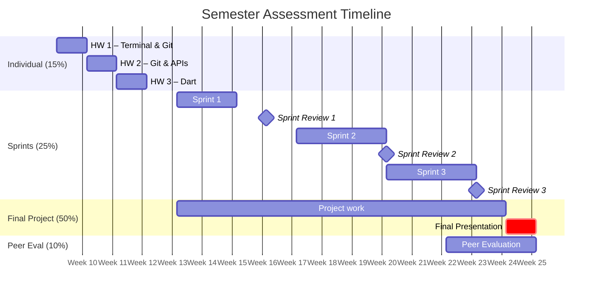

# Project Grading Guide

**Mobile Apps for Healthcare — AGH University of Krakow**

!!! info "Why this page exists"
    Research consistently shows that students perform better when they understand *exactly* how they will be assessed. This page consolidates all grading criteria, rubrics, and expectations in one place so you can reference it throughout the semester. Bookmark it.

---

## Grading Overview

Your final grade is composed of four components:

| Component | Weight | When |
|-----------|--------|------|
| Individual foundations | 15% | Weeks 1-3 |
| Sprint reviews (3x) | 25% | Weeks 7, 10, 13 |
| Final project + presentation | 50% | Week 14 |
| Peer evaluation | 10% | End of semester |

### Visual Timeline

---

## Section 1: Individual Foundations (15%)

Three GitHub-based assignments in the first three weeks build your foundational skills. Each assignment is worth **5% of your final grade** (15% total), regardless of the point scale used in the rubric.

| Week | Assignment | Skills | Points | Weight |
|------|-----------|--------|--------|--------|
| 1 | Terminal & Git | Command line, git init/add/commit, GitHub SSH | /5 | 5% |
| 2 | Git Branching & APIs | Branches, PRs, merge conflicts, curl, REST APIs | /10 | 5% |
| 3 | Dart Fundamentals | Types, null safety, OOP, async/await | /10 | 5% |

Your score on each assignment is converted to a percentage of its 5% weight. For example, scoring 8/10 on Assignment 2 gives you 4% out of 5%.

**What "meets expectations" looks like:**

- All exercises completed and pushed to GitHub before the deadline
- Code compiles/runs without errors
- Git history shows incremental commits (not one giant commit)
- For Week 2: at least one pull request created and merged

Detailed instructions are in each week's lab workbook.

---

## Section 2: Sprint Reviews (25%)

### Purpose

Sprint reviews exist because professional software teams inspect their work regularly. This is not a test — it is a feedback loop. The goal is to demonstrate progress, reflect honestly, and plan the next iteration. Teams that engage genuinely with this process build better software.

### Task

For each sprint review, your team should prepare:

1. A working demo of features completed this sprint (live on a device or emulator)
2. A brief walkthrough of your git history (PRs, branches, code reviews)
3. A retrospective: what went well, what didn't, what you'll change
4. A plan for the next sprint with estimated user stories

All 3 sprint reviews are equally weighted. Each is scored out of 100 points.

### Definition of Done

A user story is considered **done** when all of the following are true:

- The feature meets its acceptance criteria (defined in the story description)
- The code has been reviewed and merged to `main` via a pull request
- The app builds and runs without errors
- No known bugs introduced by the story

### Sprint-Specific Expectations

**Sprint 1 — Week 7:** Core screens working, navigation, basic state management. The bar for visual polish is lower, but the bar for process setup (GitHub project board, branching strategy, first PRs) is higher. Show that your team can work together.

**Sprint 2 — Week 10:** API integration, authentication flow, data persistence. We expect evidence that you incorporated feedback from the Sprint 1 retrospective. Features should be more refined — not just "it works" but "it works well."

**Sprint 3 — Week 13:** Polish, testing, advanced features. Highest bar for quality and completeness. This is your last chance to address issues before the final presentation. Your retrospective should show growth across all three sprints.

### Rubric

#### 1. Sprint Goal Achievement — 25 points

Did the team complete what they planned for this sprint?

| Score | Descriptor |
|-------|------------|
| 23-25 | All sprint goals met. Every planned user story is done and meets the Definition of Done (see above). |
| 19-22 | Most sprint goals met (roughly 75%+). Minor items carried over with clear justification. |
| 15-18 | About half of the sprint goals met. Some stories incomplete without adequate explanation. |
| 10-14 | Fewer than half of the planned stories completed. Significant scope was dropped. |
| 0-9   | Little to no progress toward sprint goals. No working increment delivered. |

#### 2. Demo Quality — 20 points

Does the demo show working features? Is the app stable during the demonstration?

| Score | Descriptor |
|-------|------------|
| 18-20 | Live demo runs smoothly with no crashes. Features demonstrated clearly and convincingly. Edge cases handled. |
| 14-17 | Demo shows working features with minor glitches. Core functionality is stable. |
| 10-13 | Demo shows partial functionality. Some features crash or behave unexpectedly. |
| 6-9   | Demo is unstable. Multiple crashes or errors. Features are hard to distinguish. |
| 0-5   | No working demo or app does not launch. |

#### 3. Git Workflow & Process — 20 points

Proper branch usage, pull requests with reviews, meaningful commits, and project board updated.

| Score | Descriptor |
|-------|------------|
| 18-20 | Feature branches used consistently. All PRs have at least one reviewer and meaningful descriptions. Commits are atomic and well-messaged. Project board reflects current sprint state accurately. |
| 14-17 | Branches and PRs used for most work. Commit messages are mostly meaningful. Project board is up to date with minor gaps. |
| 10-13 | Some work committed directly to main. PRs exist but lack reviews or descriptions. Board is partially maintained. |
| 6-9   | Minimal branch usage. Few or no PRs. Commit messages are vague (e.g., "fix", "update"). Board is neglected. |
| 0-5   | All work on a single branch. No PRs. No project board usage. |

#### 4. Teamwork & Collaboration — 15 points

All members contributing (visible in git history) and performing good code reviews.

| Score | Descriptor |
|-------|------------|
| 14-15 | All team members have meaningful commits throughout the sprint. Code reviews are thoughtful with constructive feedback. Pair programming or knowledge sharing is evident. |
| 11-13 | Most members contribute regularly. Code reviews exist and contain some substantive comments. |
| 8-10  | Uneven contribution — one or two members dominate the commit history. Reviews are superficial (e.g., "LGTM" only). |
| 4-7   | One member does most of the work. Minimal or no code review activity. |
| 0-3   | Only one contributor visible. No evidence of collaboration. |

#### 5. Retrospective Quality — 10 points

Honest reflection on the sprint with actionable improvements identified.

| Score | Descriptor |
|-------|------------|
| 9-10  | Candid reflection on what went well and what did not. Specific, actionable improvements identified for next sprint. Evidence that previous retrospective items were addressed. |
| 7-8   | Reasonable reflection with some actionable items. Previous improvements partially addressed. |
| 5-6   | Generic reflection (e.g., "we need to communicate better") without concrete actions. |
| 3-4   | Minimal reflection. No clear improvement plan. |
| 0-2   | No retrospective conducted or submitted. |

#### 6. Sprint Planning — 10 points

Clear goals for the next sprint with stories estimated.

| Score | Descriptor |
|-------|------------|
| 9-10  | Next sprint has a clear, focused goal. User stories are well-defined with acceptance criteria and effort estimates. Scope is realistic based on past velocity. |
| 7-8   | Sprint goal is defined. Most stories have estimates. Scope is generally reasonable. |
| 5-6   | Sprint goal is vague. Stories lack estimates or acceptance criteria. |
| 3-4   | Minimal planning. No clear goal. Stories are undefined. |
| 0-2   | No sprint planning conducted. |

### What Does Each Grade Look Like?

| Grade | Score | What it means |
|-------|-------|---------------|
| **Excellent** | 90-100 | Outstanding work across all criteria. The team operates like a professional development team. |
| **Good** | 75-89 | Solid performance with minor areas for improvement. Team demonstrates competence in agile workflow. |
| **Satisfactory** | 60-74 | Acceptable work but with notable gaps in process, collaboration, or delivery. |
| **Needs Improvement** | < 60 | Significant deficiencies in multiple areas. Team must address issues before the next review. |

??? example "What excellent looks like (90+)"
    The team demos a working feature on a real device. The demo is smooth — no crashes, no "let me restart the app." They walk through their GitHub board showing completed stories, open PRs with real code review comments (not just "LGTM"), and a clean branch history. The retrospective is honest: "We underestimated the login screen by 2 days because none of us had done JWT before — next sprint we're time-boxing unknowns to 1 day before asking for help." The next sprint plan has specific stories with point estimates.

??? example "What satisfactory looks like (60-74)"
    The app runs but has visible bugs during the demo. Most features are there but some are clearly unfinished. Git history shows a few PRs but also direct pushes to main. The retrospective is generic ("we need to communicate better") without specific actions. One team member seems to have done most of the work based on the commit history.

---

## Section 3: Final Project + Presentation (50%)

### Purpose

The final presentation is your opportunity to demonstrate what you've learned — not just the app you built, but how you built it, why you made the decisions you made, and what you'd do differently. This mirrors how real teams present their work to stakeholders.

### Task

Your team delivers a 15-minute presentation:

- **10 minutes:** present the problem, show the app (live demo), explain key technical decisions, discuss mHealth considerations
- **5 minutes:** Q&A from the instructor and peers

Before the presentation, ensure your GitHub repository is clean: README updated, no hardcoded secrets, meaningful commit history visible.

### Minimum Specification

!!! warning "Pass/Fail Gate"
    To be eligible for full grading, the project must meet **ALL** of these:

    - [ ] App launches on a device/emulator without crashing
    - [ ] At least 3 distinct screens implemented
    - [ ] Backend API connection functional
    - [ ] Authentication flow present
    - [ ] Git history shows PR-based workflow (no direct push to main)
    - [ ] Data privacy considered (no plaintext sensitive data)
    - [ ] All team members present and contributing to presentation

    Projects that do not meet these minimums receive a maximum of **40/100**.

### Rubric

#### 1. Functionality — 20 points

The app works, solves the stated problem, and handles errors gracefully.

| Score | Descriptor |
|-------|------------|
| 18-20 | App fully addresses the problem stated in the proposal. All core features work reliably. Edge cases and errors are handled gracefully with informative user feedback. |
| 14-17 | App addresses the core problem. Most features work. Error handling is present but incomplete in some areas. |
| 10-13 | App partially addresses the problem. Some features are incomplete or buggy. Basic error handling exists. |
| 6-9   | App has significant bugs or missing features. Error handling is minimal; crashes may occur. |
| 0-5   | App does not run or fails to address the stated problem in any meaningful way. |

#### 2. Code Quality — 15 points

Clean, readable code with proper git history and no hardcoded secrets.

| Score | Descriptor |
|-------|------------|
| 14-15 | Code is clean, well-organized, and follows Dart/Flutter conventions. Git history shows meaningful commits, consistent use of branches and PRs with reviews. No hardcoded API keys, passwords, or secrets anywhere in the repository history. |
| 11-13 | Code is generally clean with minor style inconsistencies. Git history is mostly well-structured. No secrets in the current codebase (minor historical issues acceptable if addressed). |
| 8-10  | Code has readability issues (e.g., poor naming, large functions). Git history is messy — large monolithic commits, minimal PR usage. |
| 4-7   | Code is difficult to follow. Little evidence of code review. Hardcoded secrets found in the repository. |
| 0-3   | Code is chaotic with no consistent structure. No meaningful git workflow used. |

#### 3. Architecture — 15 points

Separation of concerns, reasonable project structure, and appropriate state management.

| Score | Descriptor |
|-------|------------|
| 14-15 | Clear separation between UI, business logic, and data layers. Project structure is logical and easy to navigate. State management solution is appropriate and consistently applied. |
| 11-13 | Reasonable separation of concerns with minor violations. Project structure is mostly logical. State management is used but with some inconsistencies. |
| 8-10  | Some attempt at structure, but business logic is mixed into UI widgets. State management is ad-hoc or inconsistent. |
| 4-7   | Minimal separation of concerns. Most logic resides in widget files. No clear project structure. |
| 0-3   | No discernible architecture. All code in a few monolithic files. |

#### 4. mHealth Awareness — 15 points

Data privacy is considered, the app is appropriate for target users, and accessibility has been addressed.

| Score | Descriptor |
|-------|------------|
| 14-15 | Team demonstrates strong awareness of health data privacy (e.g., encryption, minimal data collection, informed consent). App is designed with the target user group in mind. Accessibility features implemented (e.g., screen reader support, sufficient contrast, scalable text). Relevant regulations identified and discussed. |
| 11-13 | Privacy considerations are present (e.g., no plaintext storage of sensitive data). Some accessibility features implemented. Basic regulatory awareness demonstrated. |
| 8-10  | Privacy is mentioned but not fully addressed in the implementation. Accessibility is minimal. Regulatory context is vague. |
| 4-7   | Little evidence of privacy or accessibility considerations. No regulatory awareness demonstrated. |
| 0-3   | Health data handled carelessly. No consideration of the target user population, accessibility, or regulations. |

#### 5. Presentation Quality — 15 points

Clear communication, a working live demo, and all team members present and participating.

| Score | Descriptor |
|-------|------------|
| 14-15 | All team members present and contribute meaningfully to the presentation. Communication is clear and well-paced. Live demo runs smoothly and effectively showcases the app. Slides (if used) are clean and support the narrative. |
| 11-13 | All members present; most contribute. Communication is clear. Demo works with minor hiccups. |
| 8-10  | Some members contribute minimally. Presentation is disorganized or hard to follow. Demo has notable issues. |
| 4-7   | One or more members absent without justification. Presentation is unclear. Demo fails or is skipped. |
| 0-3   | Team is largely unprepared. No demo. Poor communication throughout. |

#### 6. User Experience — 10 points

Intuitive UI, consistent design language, and proper handling of loading and error states.

| Score | Descriptor |
|-------|------------|
| 9-10  | UI is intuitive and requires no explanation. Design is visually consistent (colors, typography, spacing). Loading indicators, empty states, and error messages are present and helpful. Navigation is logical. |
| 7-8   | UI is generally intuitive. Design is mostly consistent. Loading and error states exist for core flows. |
| 5-6   | UI works but is not intuitive — users may need guidance. Design inconsistencies are noticeable. Some loading/error states missing. |
| 3-4   | UI is confusing. No consistent design language. Loading and error states largely absent. |
| 0-2   | UI is unusable or severely broken. No attention to design or user feedback. |

#### 7. Reflection & Learning — 10 points

Honest assessment of what went well, what went poorly, and what the team would do differently.

| Score | Descriptor |
|-------|------------|
| 9-10  | Team provides a candid, thoughtful reflection. Clearly articulates lessons learned — both technical and process-related. Identifies specific things they would change with concrete reasoning. |
| 7-8   | Reasonable reflection with some genuine insights. Lessons learned are mentioned but could be more specific. |
| 5-6   | Reflection is superficial or generic (e.g., "we should have started earlier"). Limited evidence of deep learning. |
| 3-4   | Minimal reflection. Team struggles to articulate what they learned. |
| 0-2   | No reflection provided or team claims everything was perfect with no room for improvement. |

### What Does Each Grade Look Like?

| Grade | Score | What it means |
|-------|-------|---------------|
| **Excellent** | 90-100 | Outstanding project that demonstrates mastery of mobile development, health-tech awareness, and professional teamwork. |
| **Good** | 75-89 | Strong project with solid technical execution and good awareness of mHealth considerations. |
| **Satisfactory** | 60-74 | Acceptable project that meets minimum requirements but has notable gaps in quality, process, or health-tech awareness. |
| **Needs Improvement** | < 60 | Project has significant deficiencies. Core requirements are not met or quality is well below expectations. |

??? example "What excellent looks like (90+)"
    The team presents a medication reminder app for elderly patients. The demo runs on a physical phone — no crashes. They explain why they chose large touch targets and high-contrast colors (accessibility for their target user group). They discuss how they store medication data encrypted locally and only sync anonymized usage analytics. The architecture uses a clean separation: UI layer, service layer, repository layer. Their git history shows consistent PR-based workflow with substantive code reviews. During Q&A, every team member can answer technical questions about any part of the app.

---

## Section 4: Peer Evaluation (10%)

### Purpose

Peer evaluation ensures individual accountability in team projects. Your honest feedback helps ensure fair grading and helps your teammates grow as collaborators. This is a professional skill — giving constructive feedback is something you'll do throughout your career.

### How It Works

- Each student evaluates every teammate (anonymously)
- 5 criteria, each scored 1-5 (total out of 25 per evaluator)
- Scores are averaged across all evaluators, then normalized within each team
- The instructor reviews outliers and concerning comments individually

### The 5 Criteria

| Criterion | What to assess |
|-----------|---------------|
| **Technical Contribution** | Quality and volume of code contributions, understanding of the tech stack, ability to implement features independently |
| **Collaboration** | Willingness to help, openness to feedback, constructive discussions, participation in code reviews |
| **Reliability** | Punctuality, meeting deadlines, following through on commitments, availability |
| **Initiative** | Proactively finding/fixing issues, volunteering for tasks, proposing improvements |
| **Communication** | Keeping the team informed, raising blockers early, clarity in written and verbal communication |

### Score-to-Grade Mapping

| Normalized Average | Grade Contribution (out of 10%) |
|---|---|
| 4.5 - 5.0 | 10% (full credit) |
| 4.0 - 4.4 | 9% |
| 3.5 - 3.9 | 8% |
| 3.0 - 3.4 | 7% |
| 2.5 - 2.9 | 5% |
| 2.0 - 2.4 | 3% |
| Below 2.0 | 0-2% (reviewed individually by the instructor) |

If your average score is below 2.5 or if open-ended comments raise concerns, the instructor will review your evaluations individually and may have a follow-up conversation before assigning the final peer evaluation grade.

### Tips for Giving Constructive Feedback

- **Be specific.** "You were always available on Slack within an hour when I was stuck" is more useful than "good communication."
- **Focus on behaviors, not personality.** "Commits were often pushed the night before the deadline" rather than "you're lazy."
- **Be honest but kind.** Inflating scores undermines the process for everyone. If someone contributed less, say so — it helps them improve.
- **Use the open-ended questions.** The numeric scores tell *what*; your written comments explain *why*.

---

## Section 5: Project Requirements Checklist

Use this checklist to verify your project meets all requirements before the final presentation.

### Minimum Technical Requirements

- [ ] Health-related mobile application (patient-facing or clinician-facing)
- [ ] At least 3 distinct screens
- [ ] API connection to a backend (own FastAPI or provided endpoint)
- [ ] Authentication flow (login/register)
- [ ] Git workflow with pull requests (no direct push to main)
- [ ] 1-page proposal submitted by Week 5

### mHealth-Specific Requirements

- [ ] Health-related problem with clearly identified target users
- [ ] Data privacy approach documented (how sensitive data is stored, transmitted, protected)
- [ ] Accessibility considerations addressed (e.g., contrast, text scaling, touch targets)
- [ ] Relevant regulatory framework identified (GDPR/HIPAA/MDR awareness — you don't need to be compliant, but you need to know what applies)

### Quality Expectations

- [ ] App launches without crashes
- [ ] Error states handled gracefully (no unhandled exceptions shown to user)
- [ ] Loading states present for async operations
- [ ] README in the repository is up to date
- [ ] No hardcoded API keys, passwords, or secrets in the repository
- [ ] Meaningful commit history (not one giant commit per sprint)

---

## Section 6: Timeline & Milestones

| Week | What's Due | Details |
|------|-----------|---------|
| 1 | Assignment 1 | Terminal & git exercises (individual, 5%) |
| 2 | Assignment 2 | Git branching & API exercises (individual, 5%) |
| 3 | Assignment 3 | Dart fundamentals exercises (individual, 5%) |
| 4 | Team formation | Teams of 3-4 formed, project idea brainstorming |
| **5** | **Verbal pitch + proposal + sprint planning** | 2-minute verbal pitch; 1-page proposal submitted via GitHub; sprint planning workshop |
| 6-7 | Sprint 1 | Core screens, navigation, basic state management |
| **7** | **Sprint Review 1** | Demo + retrospective + Sprint 2 plan (~8.3%) |
| 8-10 | Sprint 2 | API integration, auth flow, data persistence |
| **10** | **Sprint Review 2** | Demo + retrospective + Sprint 3 plan (~8.3%) |
| 11-13 | Sprint 3 | Polish, testing, advanced features |
| **13** | **Sprint Review 3** | Demo + retrospective + final prep plan (~8.3%) |
| 13-14 | Peer evaluation | Anonymous teammate evaluations submitted |
| **14** | **Final presentation** | 15-min presentation + live demo (50%) |

!!! tip "Plan ahead"
    The jump from Sprint 2 to the final presentation is only 4 weeks. Start thinking about your presentation structure and "final polish" list during Sprint 2, not after Sprint 3.
